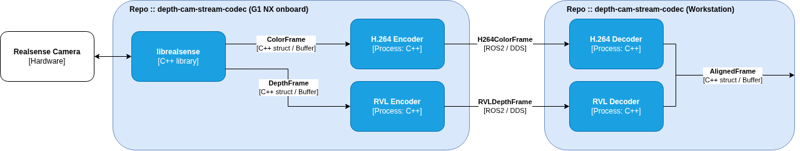

# depth-cam-stream-codec

ROS2 Humble package for streaming Intel RealSense depth camera frames over a network with lightweight compression.

- **Color** — H.264 (Annex-B) via x264
- **Depth** — RVL (Run-Length Variable-Length) lossless

---

## Architecture



---

## Dependencies

| Package | Purpose | Tx | Rx |
|---------|---------|:--:|:--:|
| ROS2 Humble | middleware | ✓ | ✓ |
| librealsense2 | RealSense SDK | ✓ | |
| x264 | H.264 encoder | ✓ | |
| libavcodec | H.264 decoder | | ✓ |
| libavutil | AVPacket / AVFrame utilities | | ✓ |
| libswscale | YUV420P → BGR8 conversion | | ✓ |
| yaml-cpp | config loading | ✓ | ✓ |

```bash
sudo apt install libx264-dev libavcodec-dev libavutil-dev libswscale-dev libyaml-cpp-dev
```

RealSense SDK: follow the [official install guide](https://github.com/IntelRealSense/librealsense/blob/master/doc/installation.md).

---

## Build

```bash
source /opt/ros/humble/setup.bash
colcon build --packages-select depth_cam_stream_codec --symlink-install
source install/setup.bash
```

---

## Configuration

See [docs/configuration.md](docs/configuration.md) for all config options.

---

## Usage from External C++ Repository

`depth_cam.hpp` provides two facades — `DepthCamTrans` (publish) and `DepthCamReceiver` (subscribe).

**`package.xml`**
```xml
<depend>depth_cam_stream_codec</depend>
```

**`CMakeLists.txt`**
```cmake
find_package(depth_cam_stream_codec REQUIRED)
target_link_libraries(your_target PRIVATE
    depth_cam_stream_codec::depth_cam_stream_codec_ros2
)
```

**Tx side**
```cpp
#include "depth_cam_stream_codec/depth_cam.hpp"

DepthCamTrans tx("config/realsense_pipeline.yaml", "config/encoder_pipeline.yaml");
tx.start();
// camera capture + encode + publish runs in background threads
tx.stop();
```

**Rx side**
```cpp
#include "depth_cam_stream_codec/depth_cam.hpp"

DepthCamReceiver rx("config/decoder_pipeline.yaml");
rx.start();

while (rclcpp::ok()) {
    auto frame = rx.next_frame();
    if (!frame) continue;

    cv::Mat color(frame->color.height, frame->color.width,
                  CV_8UC3, frame->color.data.data());
    cv::Mat depth(frame->depth.height, frame->depth.width,
                  CV_16UC1, frame->depth.data.data());
}

rx.stop();
```

See [docs/usage.md](docs/usage.md) for the full API reference and notes.

---

